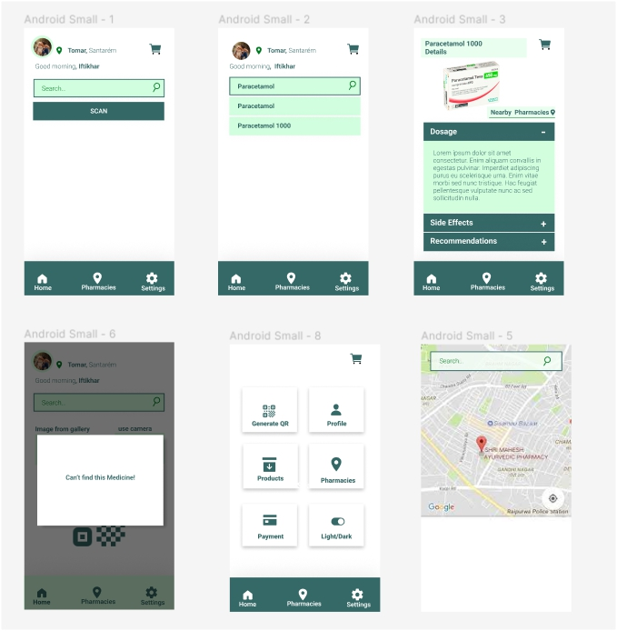
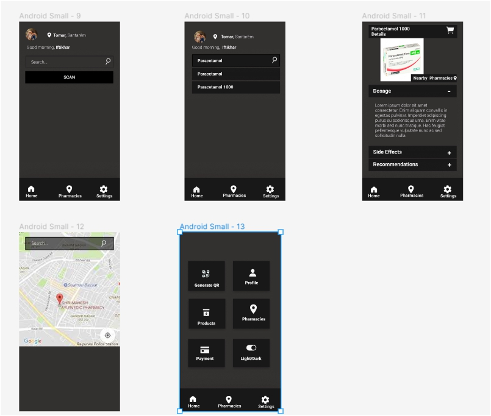

# Final_MobileProject
Final Master Mobile App Project using Kotlin

Medicine Tracking: 
An app that uses the camera to scan QR code on the package
of the drug or Medicine to provide information about the drug such as dosage, side effects, interactions with other drugs,
and so on. Additionally, the app can use maps to find nearby pharmacies that have the drug available.

## LIGHT MODE UI

## DARK MODE UI

